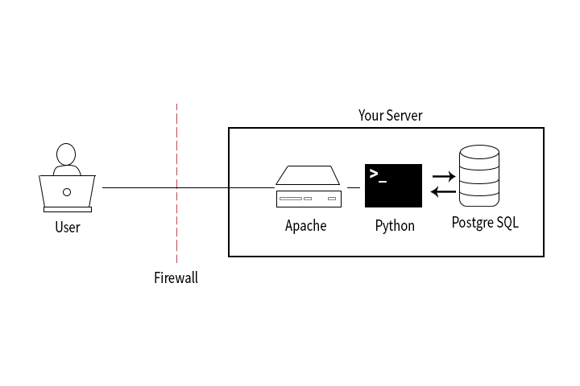

# Server setup template
Hello and welcome to this repository for default setup configurations for deploying WSGI applications to a server with apache. In here there are some scripts for configuration management to get a server up and running quickly. There are also configurationfiles for apache and wsgi.

## Getting started
Instructions on how to get stuff up and running

### Prereq
- Ansible
- A WSGI application
- A Ubuntu VPS (tested and working with Ubuntu EC2)

### Instructions
1. Clone this repository
2. Run the ansible script to do the initial serverconfigurations
3. Clone the desired WSGI application (flask/django/etc) next to this repository
4. Run the ansible deployment script

## Summary of configurations

#### Harden server:
- Create a new user with sudo access
- Copy over SSH public keys from machine and keys folder
- Disable root login
- Change ssh port to port specified in vars
- Enable the firewall to close off all ports except 80, 123 and ssh port found in group vars
- Update all applications
- Creates database user `catalog` with limited permissions
- Makes .git folder unavaliable through the browser
#### Other config:
- Configures NTP server
#### Deploy WSGI application:
- Install apache with apache wsgi libs
- Installs and initiates PostgreSQL
- Copy over application in neighbor repository
- Copy over configurations for apache and wsgi
- Starts serving

## Resources
- [Ansible playbooks](http://docs.ansible.com/ansible/latest/playbooks.html)
- [WSGI config](http://flask.pocoo.org/docs/0.12/deploying/mod_wsgi/)
- [Passwordless sudo](https://stackoverflow.com/questions/37333305/ansible-create-a-user-with-sudo-privileges)

## LICENCE
The MIT License (MIT)

Copyright (c) 2017 Anders Hurum

Permission is hereby granted, free of charge, to any person obtaining a copy of this software and associated documentation files (the "Software"), to deal in the Software without restriction, including without limitation the rights to use, copy, modify, merge, publish, distribute, sublicense, and/or sell copies of the Software, and to permit persons to whom the Software is furnished to do so, subject to the following conditions:

The above copyright notice and this permission notice shall be included in all copies or substantial portions of the Software.

THE SOFTWARE IS PROVIDED "AS IS", WITHOUT WARRANTY OF ANY KIND, EXPRESS OR IMPLIED, INCLUDING BUT NOT LIMITED TO THE WARRANTIES OF MERCHANTABILITY, FITNESS FOR A PARTICULAR PURPOSE AND NONINFRINGEMENT. IN NO EVENT SHALL THE AUTHORS OR COPYRIGHT HOLDERS BE LIABLE FOR ANY CLAIM, DAMAGES OR OTHER LIABILITY, WHETHER IN AN ACTION OF CONTRACT, TORT OR OTHERWISE, ARISING FROM, OUT OF OR IN CONNECTION WITH THE SOFTWARE OR THE USE OR OTHER DEALINGS IN THE SOFTWARE.
